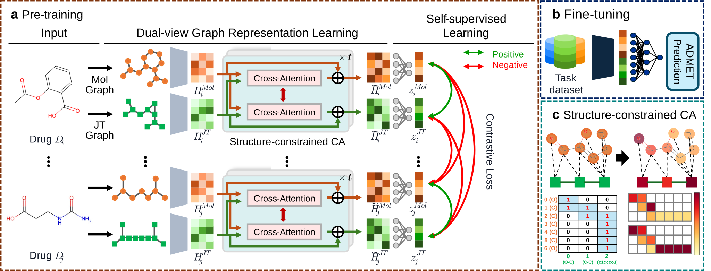

# SJoINT

**S**ubstructure-Driven **J**uncti**o**n Tree for **INT**erpretable ADMET Prediction.

SJoINT learns molecular representations from two complementary views of each
molecule — an **atom-level graph** and a **substructure-level junction tree (JT)** —
fused by **structure-constrained bidirectional cross-attention** and pre-trained
with an augmentation-free contrastive objective (NT-Xent). The pre-trained
backbone is then fine-tuned for downstream **ADMET** property prediction, and the
structure-constrained attention makes the atom ↔ substructure interactions
interpretable.



*Overview. **(a)** Pre-training: dual-view (Mol graph + JT graph) representation
learning with structure-constrained cross-attention, trained by an
augmentation-free contrastive (NT-Xent) objective. **(b)** Fine-tuning the
pre-trained backbone for ADMET prediction. **(c)** The structure-constrained
cross-attention mask, derived from atom ↔ substructure membership.*

## Repository layout

```
SJoINT/
├── requirements.txt
├── images/                  # overview figure
├── checkpoints/             # released pre-trained backbone
├── data/                    # raw + processed data (git-ignored; see data/README.md)
├── preprocess/              # raw SMILES/CSV → .pt tensors
│   ├── core/                #   shared featuriser & I/O
│   ├── pretrain/            #   vocab builder + ZINC250K tensorizer
│   ├── moleculenet/         #   downstream split + tensorizer
│   └── moleculeace/         #   activity-cliff (MoleculeACE) tensorizer
├── pretrain/                # backbone pre-training
│   ├── model.py             #   SJoINTModel (Mol/JT encoders + cross-attention)
│   ├── utils.py             #   dataset, collate, contrastive (NT-Xent) loss
│   └── train.py             #   pre-training entry point
└── finetune/                # downstream fine-tuning
    ├── model.py             #   DownstreamModel (backbone + MLP head) + loader
    ├── dataset.py           #   dataset, collate, cross-attention mask
    ├── engine.py            #   shared training engine (two-stage loop, metrics)
    ├── moleculenet/         #   MoleculeNet ADMET benchmark (train.py, configs.py)
    └── moleculeace/         #   MoleculeACE activity-cliff benchmark (van Tilborg protocol)
```

## Install

```bash
conda create -n sjoint python=3.12 -y && conda activate sjoint
pip install -r requirements.txt
# torch-scatter / torch-sparse: match your torch+CUDA build, e.g.
pip install torch-scatter==2.1.2 torch-sparse==0.6.18 \
    -f https://data.pyg.org/whl/torch-2.8.0+cu128.html
```

## Workflow

The included `data/` ships the **raw** inputs (SMILES, MoleculeNet CSVs) and the JT
vocabulary. The large **processed tensors** are *not* committed — build them locally
with the preprocessing step below (see also `data/README.md`).

### 1. Preprocess
Build the JT vocabulary and tensorize (see `preprocess/README.md`):
```bash
# JT substructure vocabulary from the pre-training corpus
python -m preprocess.pretrain.build_vocab --input data/raw/zinc250k.txt \
    --output data/vocab/vocab_zinc.json
# SMILES → .pt chunks
python -m preprocess.pretrain.tensorize --input data/raw/zinc250k.txt \
    --output data/processed/zinc250k/data --vocab data/vocab/vocab_zinc.json
```
The **MoleculeACE** activity-cliff benchmark is also supported — tensorize its
pre-split CSVs with `bash preprocess/run.sh moleculeace` (or `python -m
preprocess.moleculeace.tensorize ...`).

### 2. Pre-train the backbone
```bash
python pretrain/train.py \
    --data_path data/processed/zinc250k --checkpoint_dir checkpoints/backbone \
    --learning_rate 1e-4 --temperature 0.10 --batch_size 256 --weight_decay 5e-5 \
    --warmup_epochs 10 --max_epochs 100 --num_workers 4 --seed 42
```
The model architecture is fixed to the released backbone (defined by `SJoINTModel`
defaults in `pretrain/model.py`); only training hyper-parameters are on the CLI.
Produces `checkpoints/backbone/best_model.ckpt`, selected by held-out contrastive
loss. Training is seeded for reproducibility.

A ready-to-use pre-trained backbone is included: **`SJoINT_zinc250k_pretrained.pt`**
(ZINC250K, `jt_use_edge_attr + jt_use_jk`, lr 1e-4). Load it directly to skip
pre-training.

### 3. Fine-tune
**MoleculeNet** — two-stage downstream prediction (head warm-up → end-to-end
fine-tune; best epoch by validation loss):
```bash
python finetune/moleculenet/train.py --dataset BBBP --seed 42 \
    --pretrain_ckpt checkpoints/SJoINT_zinc250k_pretrained.pt
```
**MoleculeACE** — the activity-cliff benchmark uses the same backbone but its own
protocol (van Tilborg 2022): a fixed train/test split, hyper-parameters by k-fold
CV on the training set, final model retrained on the full training set, reporting
RMSE + RMSE_cliff:
```bash
python finetune/moleculeace/hp_search.py --task CHEMBL204_Ki   # k-fold CV HP search
python finetune/moleculeace/train.py     --task CHEMBL204_Ki   # final full-train run
```
See `finetune/README.md` for the schedules, hyper-parameters, and outputs.
`--pretrain_ckpt` defaults to the released backbone.

## Data & citations

SJoINT is pre-trained on **ZINC250K** and fine-tuned on the **MoleculeNet** ADMET
benchmarks and the **MoleculeACE** activity-cliff benchmark. Please cite the
original dataset sources when using this repository:

- **ZINC** (pre-training corpus) — Irwin & Shoichet, *ZINC – A Free Database of
  Commercially Available Compounds for Virtual Screening*, J. Chem. Inf. Model.
  45(1):177–182, 2005. https://zinc.docking.org
- **MoleculeNet** (downstream benchmarks: BBBP, BACE, ClinTox, SIDER, Tox21,
  ToxCast, FreeSolv, ESOL, Lipophilicity) — Wu et al., *MoleculeNet: A Benchmark
  for Molecular Machine Learning*, Chemical Science 9:513–530, 2018.
  https://moleculenet.org
- **MoleculeACE** (30 ChEMBL activity-cliff regression tasks; metric RMSE and
  RMSE_cliff) — van Tilborg, Alenicheva & Grisoni, *Exposing the Limitations of
  Molecular Machine Learning with Activity Cliffs*, J. Chem. Inf. Model.
  62(23):5938–5951, 2022. https://github.com/molML/MoleculeACE

The raw inputs shipped under `data/` are redistributed from these public sources
for convenience; all rights remain with the original authors.
